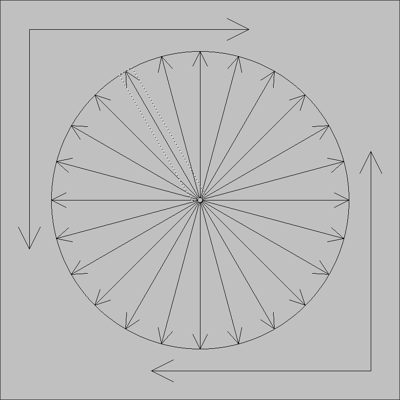
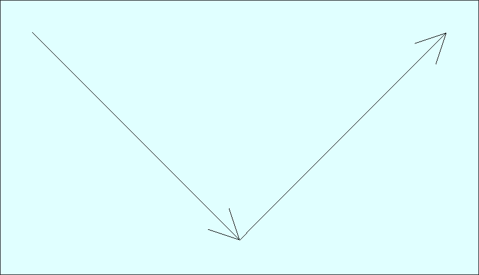

# the arrows qt project

Arrow QGraphicsItem

The ArrowItem class is an arrow shaped QGraphicsItem. This QGraphicsItem can be added to a QGraphicsScene.
See the [Qt Graphics View Framework](https://doc.qt.io/qt-6/graphicsview.html) and [QGraphicsPathItem](https://doc.qt.io/qt-6/qgraphicspathitem.html).

There are two programs included in this project showing how to use the ArrowItem class.

## ArrowsGalore



This program creates 28 arrows and 2 circles.

## TwoArrows



This program shows how to create an arrow item with two different constructors. 
The first one takes an origin point, a length and an angle in degrees:

```C++
    auto arrow1 = new ArrowItem(0, 0, 500, -45);
    scene.addItem(arrow1);
    qDebug() << "Arrow1. origin:" << arrow1->origin() << "length:" << arrow1->length()
             << "orientation:" << arrow1->angle();
```

The second constructor takes two points, the origin and the tip of the arrow:

```C++
    auto arrow2 = new ArrowItem(QPointF{-354, -354}, QPointF{0, 0});
    scene.addItem(arrow2);
    qDebug() << "Arrow2. origin:" << arrow2->origin() << "length:" << arrow2->length()
             << "orientation:" << arrow2->angle();
```

This is the standard output of this program:

```
Arrow1. origin: QPointF(0,0) length: 500 orientation: -45
Arrow2. origin: QPointF(-354,-354) length: 500.632 orientation: 45
```

## License

Copyright (c) 2023-2024, Pedro López-Cabanillas
SPDX-License-Identifier: BSD-3-Clause  
See: [LICENSE](LICENSE)  
